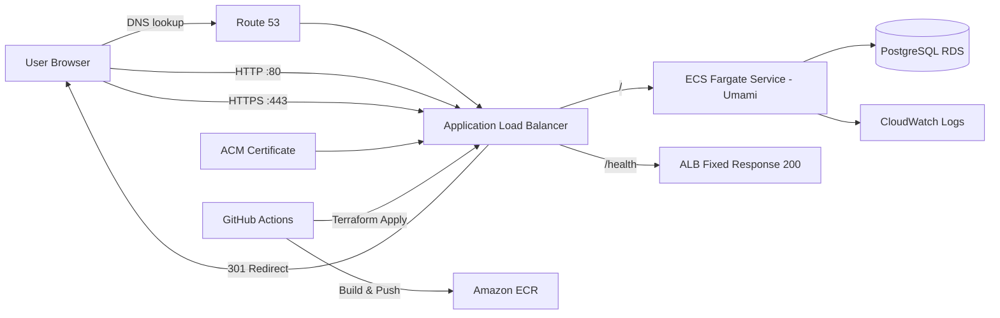

# ECS Umami Deployment (Terraform + GitHub Actions + OIDC)

This project demonstrates a production-style deployment of a containerized web application to AWS using:
- **Docker** (container build)
- **Amazon ECS Fargate** (serverless containers)
- **Application Load Balancer** (traffic routing + health endpoint)
- **RDS Postgres** (managed database)
- **ACM + Route 53** (HTTPS + custom domain)
- **Terraform modules** (infrastructure as code)
- **GitHub Actions + OIDC** (CI/CD with no static AWS keys)

Live URL: `https://tm.mhecsproject.com`  
Health endpoint (ALB-level): `https://tm.mhecsproject.com/health`

---

## Architecture


---

Key design decisions

HTTPS enforced: HTTP (80) redirects to HTTPS (443).

Stable /health: Implemented as an ALB listener rule fixed-response, so CI/CD health checks do not depend on application routes.

OIDC for CI/CD: GitHub Actions assumes an AWS IAM Role using OIDC → no long-lived credentials stored in GitHub.

Terraform modules: Networking, security groups, ALB, ECS, RDS, DNS/ACM separated for clarity and reuse.

Repo Structure  
```

.
├─ .github/workflows/
│  ├─ build-and-push.yml     # builds Docker image and pushes to ECR
│  └─ deploy.yml             # terraform plan/apply via OIDC
├─ infra/
│  ├─ main.tf                # wiring modules together
│  ├─ variables.tf           # input variables
│  ├─ outputs.tf             # key outputs (app_url, alb_dns_name, ecr url)
│  ├─ backend.tf             # remote state: S3 + DynamoDB locking (bonus)
│  └─ modules/               # reusable terraform modules
├─ Dockerfile
├─ .dockerignore
└─ README.md
```

CI/CD
1) Build & Push (Docker → ECR)

Triggered on push to main (and manual workflow_dispatch):

Builds image

Tags with commit SHA

Pushes to ECR

2) Deploy (Terraform)

Triggered on push to main (and manual workflow_dispatch):

terraform init

terraform fmt/validate

terraform plan (non-interactive)

terraform apply

Post-deploy verification:

curl -fsS https://tm.mhecsproject.com/health | grep "ok"

Requirements / Setup
AWS

Domain hosted in Route 53

ACM certificate validated for tm.mhecsproject.com in the ALB region

GitHub Secrets

Set these repository secrets:

AWS_REGION (e.g. eu-north-1)

AWS_ROLE_ARN (OIDC role for GitHub Actions)

TF_VAR_APP_SECRET (32+ random chars)

TF_VAR_DB_PASSWORD

TF_VAR_ACM_CERTIFICATE_ARN

Non-secret values can be committed via infra/terraform.auto.tfvars (optional).

How to Deploy (Local)
terraform -chdir=infra init
terraform -chdir=infra plan
terraform -chdir=infra apply
Verify:
curl -I http://tm.mhecsproject.com/         # should 301 -> https
curl -i --http2 https://tm.mhecsproject.com/health  # should 200 {"status":"ok"}

Troubleshooting Notes

503 from ALB usually means target group has no healthy targets (task crashed / wrong port / SG blocked).

TLS errors connecting to DB were resolved by setting sslmode=no-verify for RDS connectivity (Umami/Prisma TLS chain behavior).

State lock errors (bonus backend): DynamoDB lock prevents concurrent terraform runs. Use terraform force-unlock <LOCK_ID> only when you’re sure no apply is running.